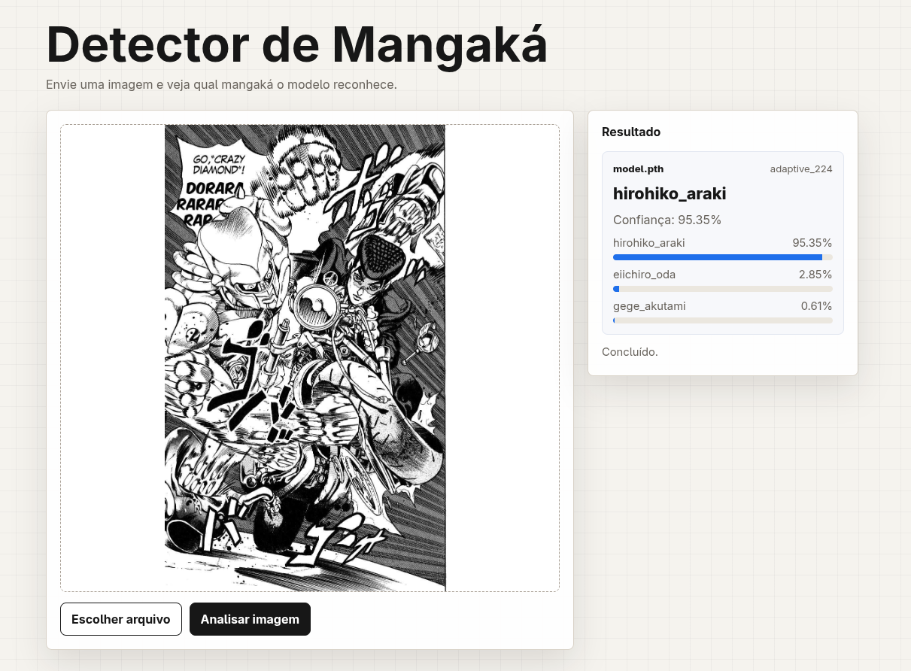

# API de Inferência CNN com Node.js + PyTorch

Esta API recebe uma imagem, aplica a normalização manga usada na inferência,
executa inferência no checkpoint `model.pth` e retorna a classe prevista. O
servidor HTTP é Node.js/Express; o worker de inferência é Python/PyTorch.



## Estrutura

```txt
cnn-node-api/
├── server.js
├── package.json
├── pnpm-lock.yaml
├── pyproject.toml
├── uv.lock
├── Dockerfile
├── docker-compose.yml
├── docs/
│   └── readme-preview.png
├── public/
│   └── index.html
└── models_saved/
    └── model.pth
```

## Rodar Localmente

Instale as dependências Node com `pnpm`:

```bash
pnpm install
```

Instale as dependências Python com `uv`:

```bash
uv sync
```

Coloque o modelo treinado em:

```txt
models_saved/model.pth
```

O servidor carrega apenas esse checkpoint. Outros arquivos `.pth` na pasta são
ignorados.

Rode a API:

```bash
pnpm start
```

Abra no navegador:

```txt
http://localhost:3000
```

## Rodar com Docker Compose

Suba a API:

```bash
docker compose up --build
```

Depois abra:

```txt
http://localhost:3000
```

O `docker-compose.yml` não monta a pasta do host dentro do container. O código e
o arquivo `models_saved/model.pth` entram na imagem durante o build. Se
alterar o código ou trocar o modelo, rode novamente:

```bash
docker compose up --build
```

## Endpoint de API

Além da interface web, o endpoint continua disponível:

```txt
POST /infer
```

O upload deve ser `multipart/form-data`, com o campo:

```txt
image
```

Exemplo:

```bash
curl -X POST http://localhost:3000/infer \
  -F "image=@./teste.png"
```

Resposta:

```json
{
  "ok": true,
  "predictedClass": "akira_toriyama",
  "predictedIndex": 0,
  "confidence": 0.9231,
  "topPredictions": [
    {
      "class": "akira_toriyama",
      "index": 0,
      "confidence": 0.9231
    }
  ]
}
```

## Pré-processamento

Todo upload usa `manga_norm`: EXIF transpose, grayscale, autocontraste leve,
pequeno ajuste de contraste e sharpening.
